<h1 align="center">
  Hi, I'm Zau Julio! 
</h1>

  <strong>Software Engineer | Tech Enthusiast | Open Source Contributor</strong>

  
  
  

---

### 🚀 About Me

I'm a Software Engineer passionate about building scalable applications and exploring the intersection of **Web Development**, **Machine Learning**, and **Cloud Infrastructure**. Currently focused on **GraphQL**, **C#/.NET**, **TypeScript**, and **Python** ecosystems.

- 🔭 I’m currently working on my personal portfolio and some secret side projects.
- 🌱 I’m learning more about Advanced ML patterns and Cloud Native architectures.
- ⚡ Fun fact: I love Photography, Cooking, and Music (check them out on my portfolio!).

### 🛠️ Tech Stack

  
  
  
  
  
  
  
  
  
  

---

### 📊 Stats

  

  

---

  

